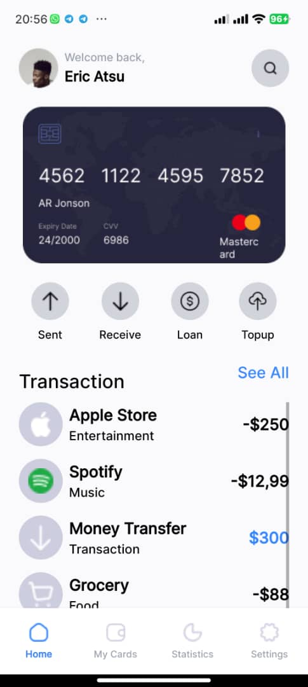
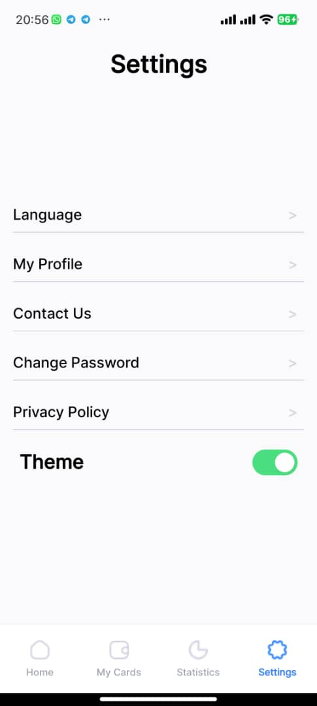
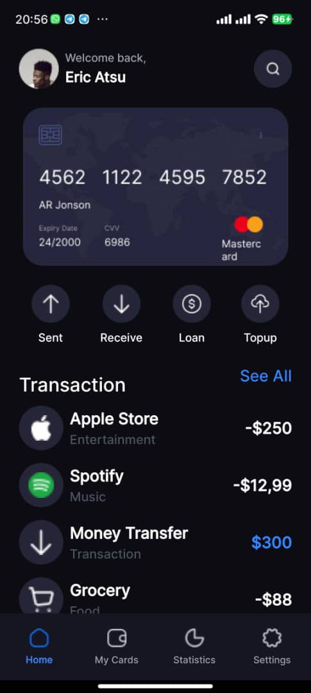
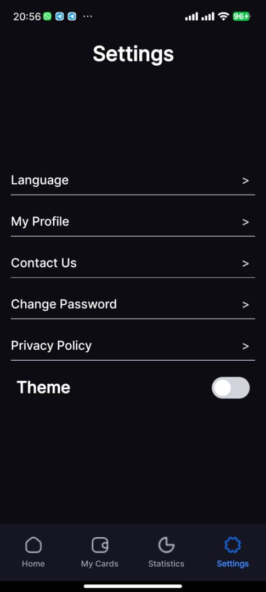

# 11318179
Tettey Michael Perry

# Description
I used the expo router to route my pages and use native wind for styling

The navigation tabs were made from the Tabs component form the expo router.

I created a theme context to give a theme provider which enables and disables the dark mode.

## App Screenshot
# Light Mode

# Dark Mode

